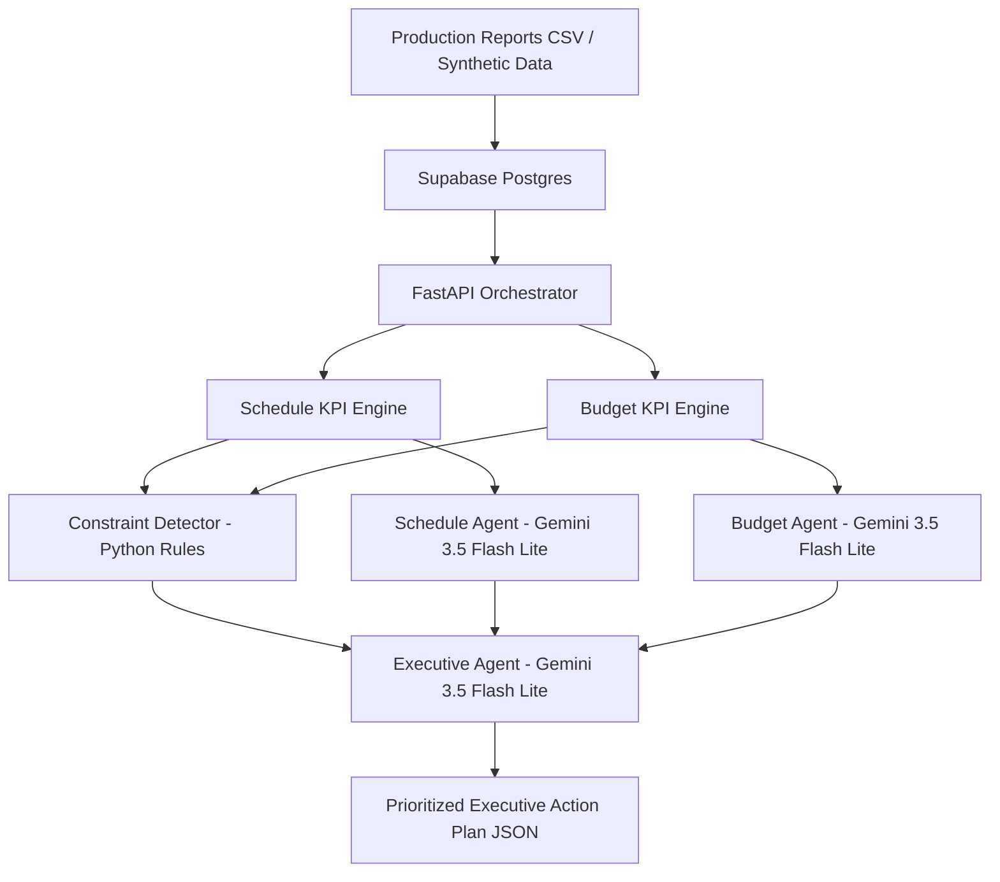

# CineOps Agentic Control Room Architecture

## High-Level Architecture



---

## Data Flow

### 1. Data Ingestion

- Synthetic production reports are stored in **Supabase Postgres**.
- The API fetches the **latest 50 records ordered by report date**.

### 2. KPI Computation (Deterministic)

The FastAPI orchestrator computes operational metrics:

#### Schedule KPIs

- Scheduled scenes
- Completed scenes
- Completion rate
- Delay percentage

#### Budget KPIs

- Average budget variance
- Maximum budget variance
- Records analyzed

### 3. Constraint Detection (Python Rules)

A deterministic rule engine identifies the dominant operational constraint:

- **SCHEDULE**
- **BUDGET**
- **BALANCED**

This step is intentionally **not handled by the LLM** to ensure reproducibility and explainability.

### 4. Specialist Agents (Gemini)

#### Schedule Agent

- Analyzes schedule risk
- Identifies bottlenecks
- Suggests recovery actions

#### Budget Agent

- Analyzes financial risk
- Detects cost outliers
- Suggests control actions

Both agents return **structured JSON only**.

### 5. Executive Agent (Gemini)

Inputs:

- Primary constraint from Python
- Schedule Agent output
- Budget Agent output

Outputs:

- Overall risk level
- Priority action
- Executive summary

---

## Example Response Structure

```json
{
  "primary_constraint": "SCHEDULE",
  "time_pressure_score": 4,
  "budget_pressure_score": 3,
  "schedule_agent": {...},
  "budget_agent": {...},
  "executive_agent": {
    "overall_risk": "HIGH",
    "priority_action": "Initiate schedule recovery plan",
    "executive_summary": "Schedule is currently the dominant operational threat while budget outliers require parallel financial review."
  }
}
```

---

## Design Principles

### Separation of Concerns

- KPI calculation is isolated from AI reasoning.
- Schedule and budget reasoning are handled independently.

### Deterministic Prioritization

- Critical business prioritization is implemented in Python.
- Same input always produces the same primary constraint.

### Explainable AI

- Each agent has a single responsibility.
- All outputs are structured and auditable.

### Agentic Orchestration

- Specialist agents do not access the database directly.
- The Executive Agent synthesizes the outputs of other agents rather than re-analyzing raw data.

---

## Technology Stack

- **FastAPI** - API orchestration
- **Supabase Postgres** - operational data store
- **Google Gemini 3.5 Flash Lite** - specialist and executive agents
- **Python rule engine** - constraint detection
- **JSON** - machine-readable agent communication

---

## Current Capability

The system can analyze recent production operations, determine whether schedule or budget is the dominant business risk, and generate a prioritized executive action plan through coordinated AI agents.